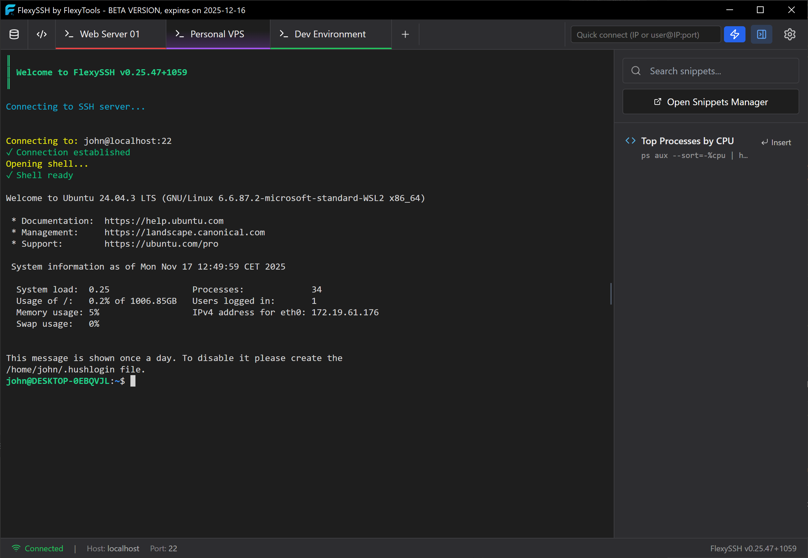
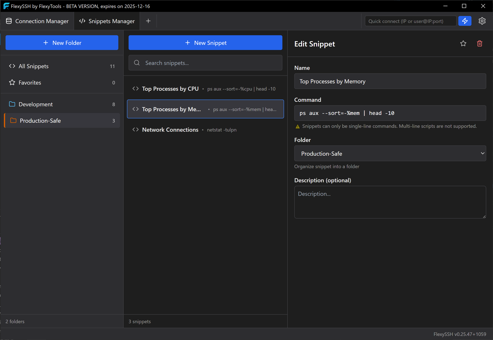

# 🚀 FlexySSH

**Modern SSH Terminal Client for Windows**

_Professional SSH client with beautiful interface and powerful features_

[Download](https://github.com/flexytools-dev/flexyssh-release/releases) • [Documentation](#-quick-start) • [Features](#-features)

> **⚠️ Beta Version Notice**
> FlexySSH is still in **beta** - we're actively building and improving it based on your feedback. You might run into a bug or two, but that's part of the journey! Help us make it better by reporting issues or suggesting features.
>
> ⏰ Each beta version has a 30-day expiration for security reasons - it may contain unpatched bugs or vulnerabilities. We'll release fresh, updated versions regularly. Make sure to update when a new release drops!

---

## 📸 Screenshots

_Connection Manager • Terminal Sessions • Snippet Manager_

---

## ✨ Features

### 🔐 Secure Connections

- **Multiple Authentication Methods** - Password, SSH key, or SSH agent
- **Encrypted Credential Storage** - Your passwords and keys are stored securely
- **Session Management** - Manage multiple SSH connections simultaneously

### 📁 Smart Organization

- **Connection Manager** - Organize your servers in colored folders
- **Favorites** - Quick access to frequently used connections
- **Search & Filter** - Find any connection instantly
- **Custom Colors** - Visual organization with connection and folder colors

### 🖥️ Professional Terminal

- **Full xterm.js Terminal** - Complete ANSI color support and terminal features
- **Multiple Tabs** - Work with several connections at once
- **Command Snippets** - Save and reuse frequently used commands
- **Customizable Appearance** - Adjust fonts, colors, and terminal themes

### ⚡ Productivity Features

- **Quick Connect** - Rapid connection via tab bar
- **Tab Duplication** - Double-click to duplicate sessions
- **Drag & Drop Tabs** - Reorder tabs to suit your workflow
- **Keyboard Shortcuts** - Work faster with comprehensive hotkeys

## 📥 Installation

### Getting Started

1. **Grab the installer** from our [Releases page](https://github.com/flexytools-dev/flexyssh-release/releases) 📦

2. **Your browser might get protective** 🛡️

   - Click **"Keep"** or **"Keep anyway"**
   - We're a new app building our reputation - totally normal!

3. **Windows SmartScreen will probably say hi** 👮

   - Click **"More info"** → **"Run anyway"**
   - This happens because we're still in beta (working on official signing!)

4. **Follow the installer** - it's pretty straightforward ✨

5. **Launch FlexySSH** and start managing your servers! 🎉

> **💡 Why all the warnings?**
> We're a new app! Once we get enough users and an official code signing certificate, these warnings will disappear. For now, we're safe - just not famous yet 😊

## 🚀 Quick Start

**First time here? Let's get you connected!**

1. **Create your first connection** 🔌

   - Hit "New Connection" in the Connection Manager
   - Fill in your server details (host, port, username)
   - Pick your auth method (password or SSH key)

2. **Connect!** ⚡

   - Click that shiny "Connect" button
   - Enter credentials if needed
   - Boom! You're in the terminal 🎯

3. **Stay organized** 📁
   - Group connections in colored folders
   - Star your favorites for quick access
   - Use colors to tell projects apart at a glance

**Pro tip:** Double-click any terminal tab to duplicate the session instantly! 🚀

## 🔒 Security & Privacy

We take your security seriously - here's our promise:

Your servers, your data, your privacy. Period.

For full legal details about how we (don’t) process your data, see the [EULA](licenses/EULA.md). In short: FlexySSH does not collect or transmit any personal data to FlexyTools or third parties; everything remains on your machine under your control.

Your servers, your data, your privacy. Period.

## 📝 License

This software is proprietary. Please see the [EULA](licenses/EULA.md) for terms of use.

For third-party licenses, see [Third-Party Licenses](licenses/THIRD_PARTY_LICENSES.md).

---

**Made with ❤️ by FlexyTools**

