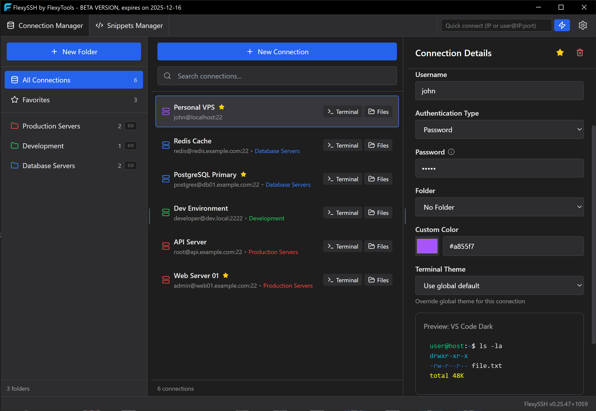
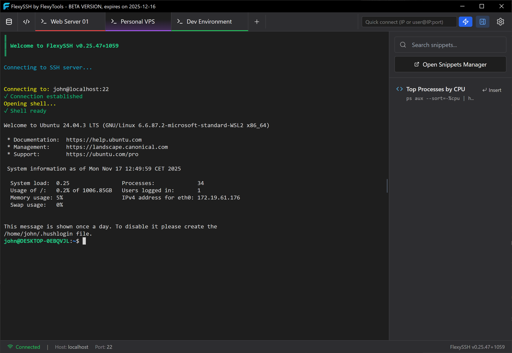

# 🚀 FlexySSH

**Modern SSH Terminal Client for Windows**

_Professional SSH client with beautiful interface and powerful features_

[Download](https://github.com/flexytools-dev/flexyssh/releases) • [Documentation](#-quick-start) • [Features](#-features)

> **⚠️ Beta Version Notice**
> FlexySSH is currently in active development and released as a **beta version**. While we strive for stability, you may encounter bugs or incomplete features. We appreciate your feedback and bug reports to help us improve!

---

## 📸 Screenshots

_Connection Manager • Terminal Sessions • Snippet Manager_

---

## ✨ Features

### 🔐 Secure Connections

- **Multiple Authentication Methods** - Password, SSH key, or SSH agent
- **Encrypted Credential Storage** - Your passwords and keys are stored securely
- **Session Management** - Manage multiple SSH connections simultaneously

### 📁 Smart Organization

- **Connection Manager** - Organize your servers in colored folders
- **Favorites** - Quick access to frequently used connections
- **Search & Filter** - Find any connection instantly
- **Custom Colors** - Visual organization with connection and folder colors

### 🖥️ Professional Terminal

- **Full xterm.js Terminal** - Complete ANSI color support and terminal features
- **Multiple Tabs** - Work with several connections at once
- **Command Snippets** - Save and reuse frequently used commands
- **Customizable Appearance** - Adjust fonts, colors, and terminal themes

### ⚡ Productivity Features

- **Quick Connect** - Rapid connection via tab bar
- **Tab Duplication** - Double-click to duplicate sessions
- **Drag & Drop Tabs** - Reorder tabs to suit your workflow
- **Keyboard Shortcuts** - Work faster with comprehensive hotkeys

## 📥 Installation

### Download & Install

1. **Download** the latest installer from [Releases](https://github.com/flexytools-dev/flexyssh/releases)

2. **Allow the download**

   - Your browser may warn about the file being potentially unsafe
   - Click **"Keep"** or **"Keep anyway"** to proceed
   - This is normal for new applications - our installer is safe and will be signed in future releases

3. **Windows SmartScreen**

   - Windows may show a "Windows protected your PC" warning
   - Click **"More info"** and then **"Run anyway"**
   - This happens because we're still in beta and building our reputation with Microsoft

4. **Run** the setup wizard and follow the installation steps

5. **Launch** FlexySSH and start connecting!

> **ℹ️ Security Note:** These warnings are standard for new applications. FlexySSH is safe to install. We're working on obtaining official code signing certificates to eliminate these warnings in future releases.

## 🚀 Quick Start

1. **Create a Connection**

   - Click "New Connection" in the Connection Manager
   - Enter your server details (hostname, port, username)
   - Choose your authentication method

2. **Connect**

   - Click the "Connect" button
   - Enter your password or select your SSH key
   - Start working in the terminal!

3. **Organize**
   - Create folders to group related connections
   - Add colors to visually distinguish projects
   - Mark favorites for quick access

## 🎨 Screenshots

### Connection Manager

_Organize your SSH connections in a beautiful three-column interface_

### Terminal Sessions

_Professional terminal with full ANSI color support and multiple tabs_

### Snippet Manager

_Save and organize your frequently used commands_

## 🔒 Security & Privacy

- **Local Storage** - All your data stays on your computer
- **Encrypted Credentials** - Passwords and SSH keys are stored securely using Windows Credential Manager
- **No Telemetry** - We don't collect or send any usage data
- **Code Signing** - All releases are digitally signed for authenticity

## 📝 License

This software is proprietary. Please see the [EULA](LICENSE) for terms of use.

---

**Made with ❤️ by FlexyTools**

